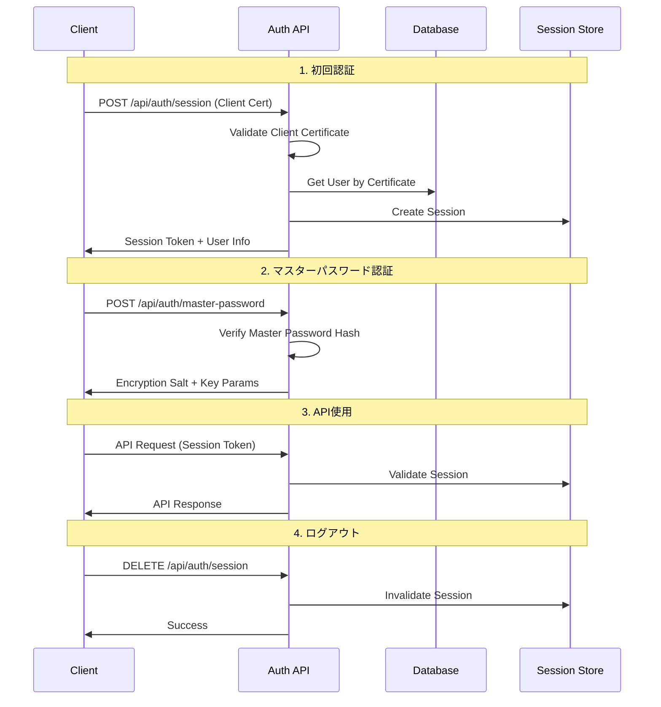

# 認証API仕様書

## 概要

認証APIは、クライアント証明書認証とセッション管理を提供します。セキュリティを最優先とし、多層防御の仕組みを実装しています。

## エンドポイント詳細

### 1. クライアント証明書検証・セッション作成

#### `POST /api/auth/session`

**概要**: クライアント証明書を検証し、新しいセッションを作成します。

**リクエスト**:
```http
POST /api/auth/session
Content-Type: application/json
X-Client-Cert: {base64_encoded_certificate}
X-Client-Cert-Fingerprint: {certificate_fingerprint}

{
  "device_info": {
    "user_agent": "Mozilla/5.0...",
    "platform": "iPhone",
    "app_version": "1.0.0"
  }
}
```

**レスポンス**:
```typescript
// 成功時 (200)
{
  "success": true,
  "data": {
    "session_token": "sess_abc123...",
    "expires_at": "2024-06-24T12:00:00Z",
    "user": {
      "id": "user-123",
      "name": "father",
      "display_name": "お父さん",
      "role": "father"
    },
    "certificate": {
      "fingerprint": "aa:bb:cc:dd...",
      "expires_at": "2025-06-23T12:00:00Z",
      "serial_number": "1234567890"
    }
  },
  "timestamp": "2024-06-23T12:00:00Z",
  "request_id": "req_abc123"
}

// エラー時 (401)
{
  "success": false,
  "error": {
    "code": "AUTH_CERT_INVALID",
    "message": "クライアント証明書が無効です"
  },
  "timestamp": "2024-06-23T12:00:00Z",
  "request_id": "req_abc123"
}
```

**実装例**:
```typescript
// src/app/api/auth/session/route.ts
import { NextRequest, NextResponse } from 'next/server';
import { validateClientCertificate } from '@/lib/auth';
import { createSession } from '@/lib/session';

export async function POST(request: NextRequest) {
  try {
    const clientCert = request.headers.get('x-client-cert');
    const fingerprint = request.headers.get('x-client-cert-fingerprint');
    
    if (!clientCert || !fingerprint) {
      return NextResponse.json({
        success: false,
        error: {
          code: 'AUTH_CERT_MISSING',
          message: 'クライアント証明書が必要です'
        }
      }, { status: 401 });
    }

    // 証明書検証
    const certValidation = await validateClientCertificate(clientCert, fingerprint);
    if (!certValidation.valid) {
      return NextResponse.json({
        success: false,
        error: {
          code: 'AUTH_CERT_INVALID',
          message: 'クライアント証明書が無効です'
        }
      }, { status: 401 });
    }

    // セッション作成
    const session = await createSession({
      userId: certValidation.user.id,
      certFingerprint: fingerprint,
      deviceInfo: await request.json()
    });

    return NextResponse.json({
      success: true,
      data: {
        session_token: session.token,
        expires_at: session.expiresAt,
        user: certValidation.user,
        certificate: certValidation.certificate
      }
    });

  } catch (error) {
    return NextResponse.json({
      success: false,
      error: {
        code: 'SYSTEM_ERROR',
        message: 'システムエラーが発生しました'
      }
    }, { status: 500 });
  }
}
```

---

### 2. セッション検証

#### `GET /api/auth/session`

**概要**: 現在のセッションの有効性を確認し、ユーザー情報を取得します。

**リクエスト**:
```http
GET /api/auth/session
Authorization: Bearer {session_token}
X-Client-Cert: {base64_encoded_certificate}
```

**レスポンス**:
```typescript
// 成功時 (200)
{
  "success": true,
  "data": {
    "user": {
      "id": "user-123",
      "name": "father",
      "display_name": "お父さん",
      "role": "father",
      "preferences": {
        "theme": "light",
        "language": "ja"
      }
    },
    "session": {
      "created_at": "2024-06-23T12:00:00Z",
      "last_accessed_at": "2024-06-23T13:30:00Z",
      "expires_at": "2024-06-24T12:00:00Z"
    },
    "permissions": [
      "password:read",
      "password:write",
      "history:read"
    ]
  }
}
```

---

### 3. マスターパスワード検証

#### `POST /api/auth/master-password`

**概要**: マスターパスワードを検証し、暗号化キーを生成するためのソルトを返します。

**リクエスト**:
```http
POST /api/auth/master-password
Authorization: Bearer {session_token}
Content-Type: application/json

{
  "master_password_hash": "pbkdf2_sha256$100000$salt$hash"
}
```

**レスポンス**:
```typescript
// 成功時 (200)
{
  "success": true,
  "data": {
    "verified": true,
    "encryption_salt": "random_salt_for_encryption",
    "key_derivation_params": {
      "algorithm": "PBKDF2",
      "hash": "SHA-256",
      "iterations": 100000,
      "salt_length": 32
    }
  }
}

// 失敗時 (401)
{
  "success": false,
  "error": {
    "code": "AUTH_MASTER_PASSWORD_INVALID",
    "message": "マスターパスワードが正しくありません"
  }
}
```

**セキュリティ考慮事項**:
- マスターパスワードは平文でサーバーに送信しない
- クライアントサイドでハッシュ化してから送信
- サーバーではさらにハッシュ化して保存
- ブルートフォース攻撃対策として失敗回数制限

---

### 4. ログアウト

#### `DELETE /api/auth/session`

**概要**: 現在のセッションを無効化します。

**リクエスト**:
```http
DELETE /api/auth/session
Authorization: Bearer {session_token}
```

**レスポンス**:
```typescript
// 成功時 (204)
// No Content

// セッション無効時 (401)
{
  "success": false,
  "error": {
    "code": "AUTH_SESSION_EXPIRED",
    "message": "セッションが無効です"
  }
}
```

---

### 5. 家族メンバー選択

#### `POST /api/auth/select-member`

**概要**: 家族メンバーを選択し、そのメンバーとしてのセッションを開始します。

**リクエスト**:
```http
POST /api/auth/select-member
Authorization: Bearer {session_token}
Content-Type: application/json

{
  "member_id": "member-123"
}
```

**レスポンス**:
```typescript
// 成功時 (200)
{
  "success": true,
  "data": {
    "active_member": {
      "id": "member-123",
      "name": "mother",
      "display_name": "お母さん",
      "role": "mother"
    },
    "permissions": [
      "password:read",
      "password:write",
      "history:read"
    ]
  }
}
```

---

## 認証フロー図



## セキュリティ実装詳細

### 1. クライアント証明書検証

```typescript
// src/lib/auth/certificate.ts
import { X509Certificate } from 'crypto';

export async function validateClientCertificate(
  cert: string, 
  fingerprint: string
): Promise<CertificateValidationResult> {
  try {
    // Base64デコード
    const certBuffer = Buffer.from(cert, 'base64');
    const x509 = new X509Certificate(certBuffer);
    
    // 基本検証
    const now = new Date();
    if (x509.validTo < now || x509.validFrom > now) {
      return { valid: false, error: 'certificate_expired' };
    }
    
    // フィンガープリント検証
    const actualFingerprint = x509.fingerprint256;
    if (actualFingerprint !== fingerprint) {
      return { valid: false, error: 'fingerprint_mismatch' };
    }
    
    // CAによる署名検証
    const isValidSignature = await verifyCertificateSignature(x509);
    if (!isValidSignature) {
      return { valid: false, error: 'invalid_signature' };
    }
    
    // ユーザー情報取得
    const user = await getUserByCertificate(x509.serialNumber);
    if (!user) {
      return { valid: false, error: 'user_not_found' };
    }
    
    return {
      valid: true,
      user,
      certificate: {
        fingerprint: actualFingerprint,
        serialNumber: x509.serialNumber,
        subject: x509.subject,
        expiresAt: x509.validTo
      }
    };
    
  } catch (error) {
    return { valid: false, error: 'certificate_parse_error' };
  }
}
```

### 2. セッション管理

```typescript
// src/lib/auth/session.ts
import { randomBytes } from 'crypto';
import { prisma } from '@/lib/db';

interface SessionData {
  userId: string;
  certFingerprint: string;
  deviceInfo: any;
}

export async function createSession(data: SessionData) {
  const token = randomBytes(32).toString('hex');
  const expiresAt = new Date(Date.now() + 24 * 60 * 60 * 1000); // 24時間

  const session = await prisma.userSessions.create({
    data: {
      id: `sess_${randomBytes(16).toString('hex')}`,
      userId: data.userId,
      sessionToken: token,
      certFingerprint: data.certFingerprint,
      deviceInfo: data.deviceInfo,
      expiresAt,
      isActive: true,
      ipAddress: getClientIP(),
      userAgent: data.deviceInfo.user_agent
    }
  });

  return {
    token,
    expiresAt,
    sessionId: session.id
  };
}

export async function validateSession(token: string, certFingerprint: string) {
  const session = await prisma.userSessions.findFirst({
    where: {
      sessionToken: token,
      certFingerprint,
      expiresAt: { gt: new Date() },
      isActive: true
    },
    include: {
      user: true
    }
  });

  if (!session) {
    return { valid: false, error: 'session_invalid' };
  }

  // セッション更新
  await prisma.userSessions.update({
    where: { id: session.id },
    data: { lastAccessedAt: new Date() }
  });

  return {
    valid: true,
    user: session.user,
    session: {
      id: session.id,
      createdAt: session.createdAt,
      lastAccessedAt: new Date(),
      expiresAt: session.expiresAt
    }
  };
}
```

### 3. レート制限

```typescript
// src/lib/auth/rate-limit.ts
import { Ratelimit } from '@upstash/ratelimit';
import { Redis } from '@upstash/redis';

const redis = new Redis({
  url: process.env.UPSTASH_REDIS_REST_URL!,
  token: process.env.UPSTASH_REDIS_REST_TOKEN!,
});

// 認証試行の制限
export const authAttemptLimit = new Ratelimit({
  redis,
  limiter: Ratelimit.slidingWindow(5, '15 m'), // 15分間に5回まで
  analytics: true,
});

// API呼び出しの制限
export const apiCallLimit = new Ratelimit({
  redis,
  limiter: Ratelimit.slidingWindow(100, '1 m'), // 1分間に100回まで
  analytics: true,
});

export async function checkAuthRateLimit(identifier: string) {
  const { success, limit, reset, remaining } = await authAttemptLimit.limit(
    `auth_${identifier}`
  );
  
  return {
    allowed: success,
    limit,
    reset,
    remaining
  };
}
```

## エラーハンドリング

### 認証エラーコード

| コード | メッセージ | HTTP Status | 説明 |
|--------|------------|-------------|------|
| `AUTH_CERT_MISSING` | クライアント証明書が必要です | 401 | 証明書ヘッダーなし |
| `AUTH_CERT_INVALID` | クライアント証明書が無効です | 401 | 証明書検証失敗 |
| `AUTH_CERT_EXPIRED` | クライアント証明書の有効期限が切れています | 401 | 証明書期限切れ |
| `AUTH_SESSION_EXPIRED` | セッションの有効期限が切れています | 401 | セッション期限切れ |
| `AUTH_SESSION_INVALID` | セッションが無効です | 401 | セッショントークン無効 |
| `AUTH_MASTER_PASSWORD_REQUIRED` | マスターパスワードが必要です | 401 | マスターパスワード未入力 |
| `AUTH_MASTER_PASSWORD_INVALID` | マスターパスワードが正しくありません | 401 | マスターパスワード検証失敗 |
| `AUTH_RATE_LIMIT_EXCEEDED` | 認証試行回数の上限に達しました | 429 | レート制限 |
| `AUTH_MEMBER_NOT_FOUND` | 指定された家族メンバーが見つかりません | 404 | メンバー選択エラー |
| `AUTH_PERMISSION_DENIED` | この操作の権限がありません | 403 | 権限不足 |

### エラーレスポンス例

```typescript
// レート制限エラー
{
  "success": false,
  "error": {
    "code": "AUTH_RATE_LIMIT_EXCEEDED",
    "message": "認証試行回数の上限に達しました。15分後に再試行してください。",
    "details": {
      "retry_after": 900, // 秒
      "limit": 5,
      "reset_time": "2024-06-23T12:15:00Z"
    }
  },
  "timestamp": "2024-06-23T12:00:00Z",
  "request_id": "req_abc123"
}
```

---

## テストケース

### 1. 正常系テスト

```typescript
// tests/api/auth.test.ts
describe('Authentication API', () => {
  it('should create session with valid certificate', async () => {
    const response = await request(app)
      .post('/api/auth/session')
      .set('X-Client-Cert', validCertificate)
      .set('X-Client-Cert-Fingerprint', validFingerprint)
      .send({ device_info: mockDeviceInfo })
      .expect(200);

    expect(response.body.success).toBe(true);
    expect(response.body.data.session_token).toBeDefined();
    expect(response.body.data.user).toBeDefined();
  });

  it('should validate master password correctly', async () => {
    const sessionToken = await createTestSession();
    
    const response = await request(app)
      .post('/api/auth/master-password')
      .set('Authorization', `Bearer ${sessionToken}`)
      .send({ master_password_hash: validPasswordHash })
      .expect(200);

    expect(response.body.data.verified).toBe(true);
    expect(response.body.data.encryption_salt).toBeDefined();
  });
});
```

### 2. 異常系テスト

```typescript
describe('Authentication API - Error Cases', () => {
  it('should reject invalid certificate', async () => {
    const response = await request(app)
      .post('/api/auth/session')
      .set('X-Client-Cert', invalidCertificate)
      .expect(401);

    expect(response.body.error.code).toBe('AUTH_CERT_INVALID');
  });

  it('should enforce rate limiting', async () => {
    // 5回失敗試行
    for (let i = 0; i < 5; i++) {
      await request(app)
        .post('/api/auth/session')
        .set('X-Client-Cert', invalidCertificate)
        .expect(401);
    }

    // 6回目はレート制限
    const response = await request(app)
      .post('/api/auth/session')
      .set('X-Client-Cert', invalidCertificate)
      .expect(429);

    expect(response.body.error.code).toBe('AUTH_RATE_LIMIT_EXCEEDED');
  });
});
```

---

## 次のステップ

1. **パスワード管理API仕様書作成**
2. **OpenAPI仕様書への統合**
3. **認証ミドルウェアの実装**
4. **セキュリティテストの充実**