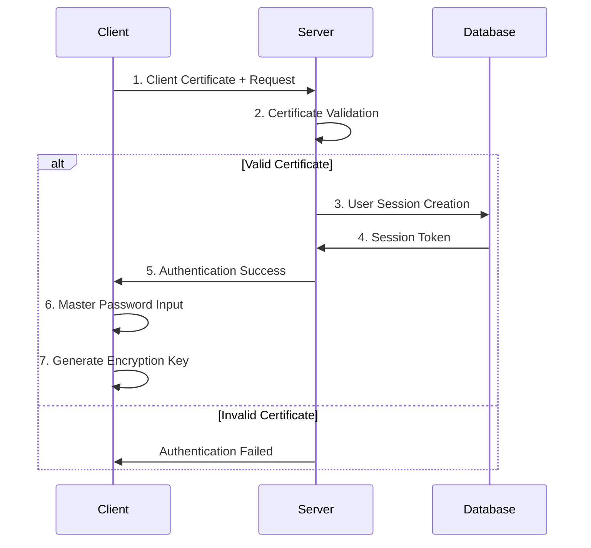
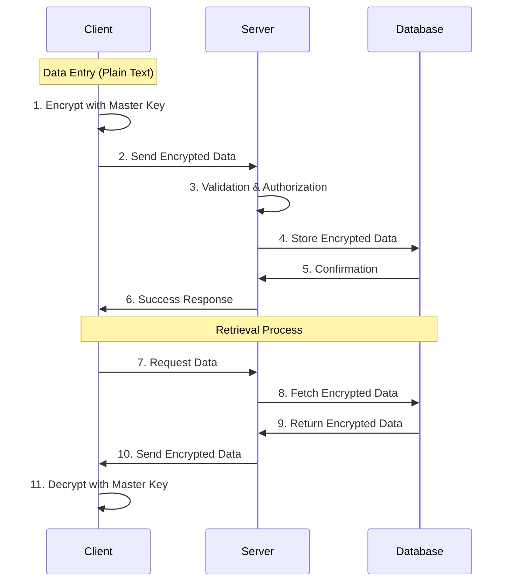

# システム設計書

## 1. システム概要

### 1.1 アーキテクチャ概要

```
┌─────────────────┐    ┌──────────────────┐    ┌─────────────────┐
│   Client        │    │   Vercel         │    │   Database      │
│   (iPhone/Web)  │◄──►│   (Frontend +    │◄──►│   (PlanetScale) │
│                 │    │    API Routes)   │    │                 │
└─────────────────┘    └──────────────────┘    └─────────────────┘
        │                       │
        │              ┌────────▼────────┐
        │              │   GitHub        │
        └──────────────┤   (Repository)  │
                       └─────────────────┘
```

### 1.2 技術スタック詳細

#### Frontend
- **Framework**: Next.js 14 (App Router)
- **Language**: TypeScript
- **UI Library**: Material-UI (MUI) v5
- **State Management**: Zustand
- **Encryption**: CryptoJS
- **PWA**: next-pwa

#### Backend
- **Runtime**: Vercel Serverless Functions
- **Authentication**: NextAuth.js + Custom Provider
- **Validation**: Zod
- **ORM**: Prisma

#### Database
- **Primary**: PlanetScale (MySQL 8.0互換)
- **Connection**: Prisma Client
- **Migration**: Prisma Migrate

## 2. セキュリティアーキテクチャ

### 2.1 Zero-Knowledge Architecture

```
┌─────────────────────────────────────────────────────────────┐
│                    Client Side                              │
│  ┌─────────────────┐    ┌─────────────────┐                │
│  │ Master Password │ ──►│ Encryption Key  │                │
│  │ (User Input)    │    │ Generation      │                │
│  └─────────────────┘    └─────────────────┘                │
│           │                       │                        │
│           ▼                       ▼                        │
│  ┌─────────────────┐    ┌─────────────────┐                │
│  │ Authentication  │    │ Data Encryption │                │
│  │ (Client Cert)   │    │ (AES-256-GCM)   │                │
│  └─────────────────┘    └─────────────────┘                │
└─────────────────────────────────────────────────────────────┘
                    │                       │
                    ▼                       ▼
┌─────────────────────────────────────────────────────────────┐
│                   Server Side                              │
│  ┌─────────────────┐    ┌─────────────────┐                │
│  │ Certificate     │    │ Encrypted Data  │                │
│  │ Validation      │    │ Storage         │                │
│  └─────────────────┘    └─────────────────┘                │
└─────────────────────────────────────────────────────────────┘
```

### 2.2 暗号化フロー

1. **マスターパスワード入力** → PBKDF2でキー派生 → AES暗号化キー生成
2. **データ暗号化** → AES-256-GCM + ランダムIV
3. **サーバー送信** → 暗号化済みデータのみ送信
4. **サーバー保存** → 暗号化されたままDB保存

## 3. データフロー設計

### 3.1 認証フロー



### 3.2 データ操作フロー



## 4. コンポーネント設計

### 4.1 Frontend アーキテクチャ

```
src/
├── app/                    # Next.js App Router
│   ├── (auth)/            # 認証グループ
│   │   ├── login/
│   │   └── setup/
│   ├── (dashboard)/       # メインアプリ
│   │   ├── passwords/
│   │   ├── history/
│   │   └── settings/
│   ├── api/               # API Routes
│   └── globals.css
├── components/            # 共通コンポーネント
│   ├── ui/               # UIコンポーネント
│   ├── forms/            # フォームコンポーネント
│   ├── layout/           # レイアウト
│   └── auth/             # 認証関連
├── lib/                  # ユーティリティ
│   ├── crypto.ts         # 暗号化関数
│   ├── auth.ts           # 認証設定
│   ├── db.ts             # DB接続
│   └── utils.ts          # 共通関数
├── store/                # 状態管理
│   ├── auth.ts
│   ├── passwords.ts
│   └── ui.ts
└── types/                # 型定義
    ├── auth.ts
    ├── password.ts
    └── common.ts
```

### 4.2 主要コンポーネント

#### 4.2.1 認証コンポーネント
- `ClientCertAuth`: クライアント証明書認証
- `MasterPasswordInput`: マスターパスワード入力
- `FamilyMemberSelector`: 家族メンバー選択

#### 4.2.2 パスワード管理コンポーネント
- `PasswordList`: パスワード一覧表示
- `PasswordForm`: パスワード登録・編集フォーム
- `PasswordCard`: パスワード情報カード
- `SearchFilter`: 検索・フィルター

#### 4.2.3 履歴管理コンポーネント
- `HistoryViewer`: 変更履歴表示
- `HistoryDiff`: 変更差分表示
- `HistoryRestore`: 履歴復元

## 5. API設計

### 5.1 エンドポイント一覧

#### 認証関連
- `POST /api/auth/certificate` - クライアント証明書検証
- `POST /api/auth/session` - セッション作成・検証
- `POST /api/auth/logout` - ログアウト

#### パスワード管理
- `GET /api/passwords` - パスワード一覧取得
- `POST /api/passwords` - パスワード作成
- `GET /api/passwords/[id]` - パスワード詳細取得
- `PUT /api/passwords/[id]` - パスワード更新
- `DELETE /api/passwords/[id]` - パスワード削除

#### 履歴管理
- `GET /api/passwords/[id]/history` - 変更履歴取得
- `POST /api/passwords/[id]/restore` - 履歴復元

#### 検索・フィルター
- `GET /api/passwords/search` - パスワード検索
- `GET /api/categories` - カテゴリ一覧取得

### 5.2 APIレスポンス形式

```typescript
// 標準レスポンス
interface APIResponse<T = any> {
  success: boolean;
  data?: T;
  error?: {
    code: string;
    message: string;
    details?: any;
  };
  meta?: {
    total?: number;
    page?: number;
    limit?: number;
  };
}

// パスワードエントリ
interface PasswordEntry {
  id: string;
  service_name: string;
  encrypted_data: string; // 暗号化された実際のパスワードデータ
  category: string[];
  owner: string;
  created_at: string;
  updated_at: string;
  metadata: {
    has_additional_fields: boolean;
    last_accessed: string;
    access_count: number;
  };
}
```

## 6. セキュリティ実装詳細

### 6.1 クライアント証明書検証

```typescript
// API Route での証明書検証
export async function POST(request: NextRequest) {
  const clientCert = request.headers.get('x-client-cert');
  
  if (!clientCert) {
    return NextResponse.json(
      { success: false, error: { code: 'NO_CERT', message: 'Client certificate required' } },
      { status: 401 }
    );
  }
  
  const isValid = await validateClientCertificate(clientCert);
  if (!isValid) {
    return NextResponse.json(
      { success: false, error: { code: 'INVALID_CERT', message: 'Invalid client certificate' } },
      { status: 401 }
    );
  }
  
  // セッション作成処理
}
```

### 6.2 暗号化実装

```typescript
// クライアントサイド暗号化
import CryptoJS from 'crypto-js';

export class PasswordCrypto {
  private static deriveKey(masterPassword: string, salt: string): string {
    return CryptoJS.PBKDF2(masterPassword, salt, {
      keySize: 256/32,
      iterations: 100000
    }).toString();
  }
  
  static encrypt(data: string, masterPassword: string): {
    encrypted: string;
    salt: string;
    iv: string;
  } {
    const salt = CryptoJS.lib.WordArray.random(128/8).toString();
    const iv = CryptoJS.lib.WordArray.random(128/8).toString();
    const key = this.deriveKey(masterPassword, salt);
    
    const encrypted = CryptoJS.AES.encrypt(data, key, {
      iv: CryptoJS.enc.Hex.parse(iv),
      mode: CryptoJS.mode.CBC,
      padding: CryptoJS.pad.Pkcs7
    }).toString();
    
    return { encrypted, salt, iv };
  }
  
  static decrypt(encryptedData: string, salt: string, iv: string, masterPassword: string): string {
    const key = this.deriveKey(masterPassword, salt);
    
    const decrypted = CryptoJS.AES.decrypt(encryptedData, key, {
      iv: CryptoJS.enc.Hex.parse(iv),
      mode: CryptoJS.mode.CBC,
      padding: CryptoJS.pad.Pkcs7
    });
    
    return decrypted.toString(CryptoJS.enc.Utf8);
  }
}
```

## 7. エラーハンドリング設計

### 7.1 エラー分類

1. **認証エラー**: 証明書無効、セッション期限切れ
2. **認可エラー**: アクセス権限なし
3. **バリデーションエラー**: 入力値不正
4. **システムエラー**: DB接続エラー、暗号化エラー
5. **ビジネスロジックエラー**: 重複登録、データ不整合

### 7.2 エラーレスポンス

```typescript
interface ErrorResponse {
  success: false;
  error: {
    code: string;           // エラーコード（英数字）
    message: string;        // ユーザー向けメッセージ（日本語）
    details?: any;          // 開発者向け詳細情報
    timestamp: string;      // エラー発生時刻
    request_id: string;     // リクエストID（トレーシング用）
  };
}
```

## 8. パフォーマンス設計

### 8.1 最適化戦略

1. **フロントエンド**:
   - React.memo、useMemo、useCallbackでの再レンダリング最適化
   - 仮想スクロール（react-window）で大量データ表示
   - Service Worker でのオフラインキャッシュ

2. **バックエンド**:
   - Prisma のクエリ最適化
   - Redis キャッシュ（Vercel KV）
   - データベースインデックス最適化

3. **ネットワーク**:
   - Vercel Edge Network でのCDN配信
   - 画像最適化（next/image）
   - gzip圧縮

### 8.2 監視・メトリクス

- Vercel Analytics での パフォーマンス監視
- Sentry でのエラートラッキング
- カスタムメトリクス（ログイン成功率、検索応答時間等）

---

## 次のステップ

1. **データベース設計** - テーブル定義とリレーション設計
2. **API詳細設計** - エンドポイント仕様書作成
3. **UI/UXワイヤーフレーム** - 画面遷移とUI設計
4. **開発環境構築** - プロジェクト初期化と開発環境準備