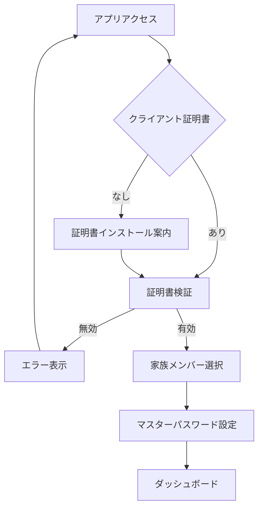
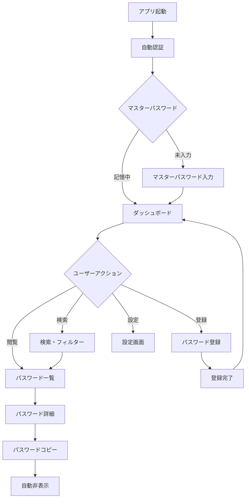
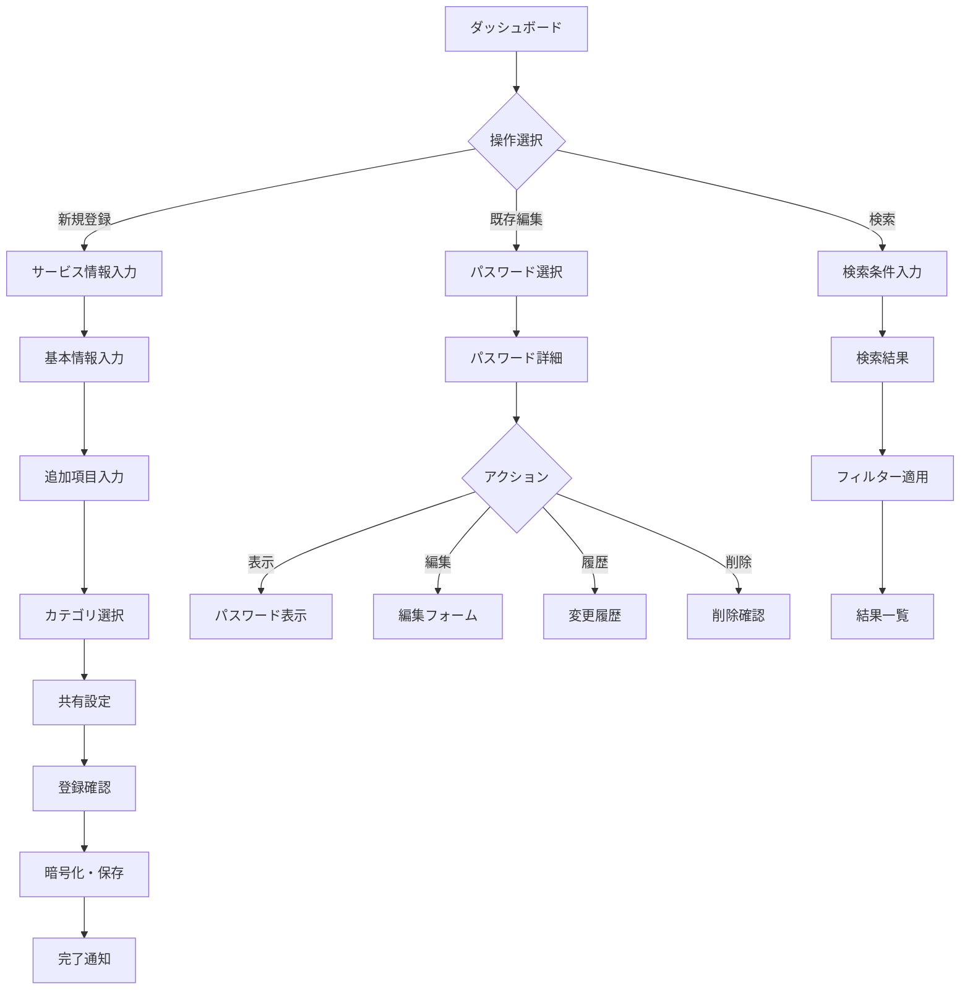

# ユーザーフロー設計書

## 概要

家族用パスワード管理システムのユーザーフローを定義します。家族全員が直感的に操作できるよう、シンプルで分かりやすい導線を設計しています。

## 主要ユーザーフロー

### 1. 初回アクセス・セットアップフロー



**詳細ステップ:**

1. **アプリアクセス**
   - URLアクセス（https://family-pass.example.com）
   - スプラッシュ画面表示
   - 証明書チェック開始

2. **証明書インストール案内**（初回のみ）
   - インストール手順説明
   - iOS設定アプリでの証明書インストール
   - 信頼設定の案内

3. **証明書検証**
   - 自動的な証明書有効性チェック
   - エラー時は分かりやすいメッセージ表示

4. **家族メンバー選択**
   - 証明書に紐づく家族メンバー一覧表示
   - アバター付きの分かりやすい選択UI

5. **マスターパスワード設定/入力**
   - 初回：マスターパスワード設定
   - 2回目以降：マスターパスワード入力
   - パスワード強度表示

6. **ダッシュボード表示**
   - メインアプリケーション画面

---

### 2. 日常利用フロー



**詳細ステップ:**

1. **自動認証**
   - セッション有効性チェック
   - クライアント証明書自動検証

2. **マスターパスワード入力**
   - 生体認証（Face ID/Touch ID）対応
   - 一定時間での自動ロック

3. **メイン操作**
   - パスワード一覧閲覧
   - 新規パスワード登録
   - 検索・フィルタリング
   - 設定変更

---

### 3. パスワード管理フロー



---

## 画面遷移図

### メイン画面構成

```
┌─────────────────────────────────────────┐
│                ヘッダー                   │
│  [ロゴ] [検索]     [通知] [設定] [ユーザー]  │
├─────────────────────────────────────────┤
│ サイドバー │        メインコンテンツ        │
│           │                            │
│ ・ダッシュ  │   ┌──────────────────────┐   │
│ ・パスワード│   │                      │   │
│ ・履歴     │   │    コンテンツエリア     │   │
│ ・設定     │   │                      │   │
│ ・ヘルプ   │   │                      │   │
│           │   └──────────────────────┘   │
├─────────────────────────────────────────┤
│                フッター                   │
│         [著作権] [バージョン]              │
└─────────────────────────────────────────┘
```

### レスポンシブ対応

**デスクトップ (1024px以上)**
- サイドバー固定表示
- 3カラムレイアウト

**タブレット (768px - 1023px)**  
- サイドバー折りたたみ
- 2カラムレイアウト

**スマートフォン (767px以下)**
- ハンバーガーメニュー
- 1カラムレイアウト
- ボトムナビゲーション

---

## 主要画面フロー

### 1. ログイン・認証画面

**画面1: 証明書確認**
```
┌─────────────────────────┐
│      家族パスワード管理     │
│                        │
│    🔐 証明書を確認中...   │
│                        │
│  クライアント証明書の      │
│  有効性を確認しています    │
│                        │
│     [しばらくお待ちください] │
└─────────────────────────┘
```

**画面2: 家族メンバー選択**
```
┌─────────────────────────┐
│      家族メンバー選択      │
│                        │
│  ┌────┐ ┌────┐ ┌────┐   │
│  │👨  │ │👩  │ │👦  │   │
│  │お父さん│ │お母さん│ │息子  │   │
│  └────┘ └────┘ └────┘   │
│                        │
│  ┌────┐               │
│  │👧  │               │
│  │娘   │               │
│  └────┘               │
└─────────────────────────┘
```

**画面3: マスターパスワード入力**
```
┌─────────────────────────┐
│    マスターパスワード      │
│                        │
│  こんにちは、お父さん      │
│                        │
│  ┌──────────────────────┐ │
│  │ ●●●●●●●●●●●●●●●● │ │
│  └──────────────────────┘ │
│                        │
│  [👆 Face ID でログイン]   │
│                        │
│      [ログイン] [キャンセル]  │
└─────────────────────────┘
```

### 2. ダッシュボード画面

```
┌─────────────────────────────────────────┐
│ [☰] 家族パスワード管理    [🔍] [🔔] [⚙️] [👤] │
├─────────────────────────────────────────┤
│          お父さんのダッシュボード           │
│                                      │
│ ┌─────────────┐ ┌─────────────┐       │
│ │ 📊 統計情報    │ │ ⚠️ 要注意      │       │
│ │ 登録済み: 45件  │ │ 期限切れ: 3件   │       │
│ │ 今月追加: 2件   │ │ 弱いPW: 1件   │       │
│ └─────────────┘ └─────────────┘       │
│                                      │
│ 📌 よく使うパスワード                    │
│ ┌──────────────────────────────────┐    │
│ │ 🏦 みずほ銀行     最終使用: 2日前    │    │
│ │ 🛒 Amazon       最終使用: 1日前    │    │
│ │ 📱 docomo       最終使用: 3日前    │    │
│ └──────────────────────────────────┘    │
│                                      │
│ 🕒 最近の変更                          │
│ ┌──────────────────────────────────┐    │
│ │ 楽天カード パスワード変更 - 6/22     │    │
│ │ Gmail アカウント追加 - 6/20         │    │
│ └──────────────────────────────────┘    │
└─────────────────────────────────────────┘
```

### 3. パスワード一覧画面

```
┌─────────────────────────────────────────┐
│ [☰] パスワード一覧      [🔍] [🔔] [⚙️] [👤] │
├─────────────────────────────────────────┤
│ [🔍 検索] [📋 カテゴリ▼] [👤 所有者▼] [➕新規] │
│                                      │
│ ┌──────────────────────────────────┐    │
│ │ 🏦 みずほ銀行                      │    │
│ │ ID: yamada****    重要度: 高       │    │
│ │ カテゴリ: 銀行     期限: 2025/6/23  │    │
│ │                           [👁️] [✏️] │    │
│ └──────────────────────────────────┘    │
│                                      │
│ ┌──────────────────────────────────┐    │
│ │ 🛒 Amazon                        │    │
│ │ ID: yamada@example.com  重要度: 中  │    │
│ │ カテゴリ: EC        期限: なし      │    │
│ │                           [👁️] [✏️] │    │
│ └──────────────────────────────────┘    │
│                                      │
│ [< 前へ]     2/5ページ      [次へ >]    │
└─────────────────────────────────────────┘
```

### 4. パスワード詳細画面

```
┌─────────────────────────────────────────┐
│ [←] みずほ銀行              [✏️] [🗑️] [⋮] │
├─────────────────────────────────────────┤
│ 🏦 みずほ銀行                           │
│ https://www.mizuhobank.co.jp/          │
│                                      │
│ 📋 基本情報                            │
│ ┌──────────────────────────────────┐    │
│ │ ユーザーID                          │    │
│ │ yamada1234      [📋コピー] [👁️表示] │    │
│ │                                  │    │
│ │ パスワード                          │    │
│ │ ●●●●●●●●●●●●  [📋コピー] [👁️表示] │    │
│ └──────────────────────────────────┘    │
│                                      │
│ 📋 追加情報                            │
│ ┌──────────────────────────────────┐    │
│ │ 取引パスワード                       │    │
│ │ ●●●●●●        [📋コピー] [👁️表示] │    │
│ │                                  │    │
│ │ 暗証番号                           │    │
│ │ ●●●●           [📋コピー] [👁️表示] │    │
│ └──────────────────────────────────┘    │
│                                      │
│ 📊 利用情報                            │
│ • 最終使用: 2024/6/21 10:30            │
│ • 使用回数: 15回                       │
│ • 有効期限: 2025/6/23                  │
│ • 重要度: 高                          │
│                                      │
│ [履歴を見る] [共有設定] [アクセスログ]      │
└─────────────────────────────────────────┘
```

### 5. パスワード登録・編集画面

```
┌─────────────────────────────────────────┐
│ [←] 新規パスワード登録       [💾] [❌]     │
├─────────────────────────────────────────┤
│ 📝 基本情報                            │
│                                      │
│ サービス名 *                           │
│ ┌──────────────────────────────────┐    │
│ │ 楽天銀行                          │    │
│ └──────────────────────────────────┘    │
│                                      │
│ サービスURL                           │
│ ┌──────────────────────────────────┐    │
│ │ https://www.rakuten-bank.co.jp/   │    │
│ └──────────────────────────────────┘    │
│                                      │
│ ユーザーID *                          │
│ ┌──────────────────────────────────┐    │
│ │ yamada@example.com               │    │
│ └──────────────────────────────────┘    │
│                                      │
│ パスワード *                          │
│ ┌──────────────────────────────────┐    │
│ │ ●●●●●●●●●●●●●●●●●●●●         │    │
│ └──────────────────────────────────┘    │
│ 強度: 🟢 強い (スコア: 4/4)              │
│                                      │
│ [➕ 追加項目を追加]                      │
│                                      │
│ 📂 カテゴリ                           │
│ [🏦 銀行] [💳 カード] [+ 追加]            │
│                                      │
│ ⚡ 重要度                             │
│ ○ 低  ○ 中  ● 高                     │
│                                      │
│ 📅 有効期限                           │
│ ┌──────────────────────────────────┐    │
│ │ 2025/06/23                       │    │
│ └──────────────────────────────────┘    │
│                                      │
│ 👥 共有設定                           │
│ □ 家族と共有する                       │
│                                      │
│ 📝 メモ                              │
│ ┌──────────────────────────────────┐    │
│ │ メインの給与振込口座                │    │
│ └──────────────────────────────────┘    │
│                                      │
│        [保存] [下書き保存] [キャンセル]     │
└─────────────────────────────────────────┘
```

---

## インタラクション設計

### 1. パスワード表示・非表示

**デフォルト状態（非表示）**
```
パスワード: ●●●●●●●●●●●● [👁️ 表示]
```

**表示状態（5秒後自動非表示）**
```
パスワード: MySecurePass123! [🙈 隠す] ⏱️ 4秒
```

**コピー機能**
```
パスワード: ●●●●●●●●●●●● [📋 コピー済み ✓]
```

### 2. 検索・フィルター

**検索ボックス**
```
┌─────────────────────────────────┐
│ 🔍 サービス名で検索...           │
└─────────────────────────────────┘
```

**フィルター展開**
```
┌─────────────────────────────────┐
│ 📋 カテゴリ    👤 所有者    ⚡ 重要度 │
│ [🏦 銀行] ✓   [👨 お父さん] ✓  [🔴 高] │
│ [🛒 EC]      [👩 お母さん]    [🟡 中] │
│ [📱 通信]     [👦 息子]       [⚪ 低] │
│                                │
│     [適用] [リセット] [閉じる]      │
└─────────────────────────────────┘
```

### 3. 通知・アラート

**成功通知**
```
┌─────────────────────────────────┐
│ ✅ パスワードを保存しました         │
│    3秒後に自動で閉じます           │
└─────────────────────────────────┘
```

**警告通知**
```
┌─────────────────────────────────┐
│ ⚠️ 期限切れのパスワードがあります   │
│    今すぐ確認 [確認] [後で]        │
└─────────────────────────────────┘
```

**エラー通知**
```
┌─────────────────────────────────┐
│ ❌ 保存に失敗しました             │
│    もう一度お試しください [再試行]   │
└─────────────────────────────────┘
```

---

## アクセシビリティ考慮事項

### 1. キーボードナビゲーション
- Tabキーでの順次フォーカス移動
- Enterキーでのアクション実行
- ESCキーでのモーダル閉じる

### 2. スクリーンリーダー対応
- 適切なARIAラベル設定
- セマンティックなHTML要素使用
- フォーカス状態の明確な表示

### 3. 色覚対応
- 色だけに依存しない情報伝達
- 十分なコントラスト比確保
- カラーパレットのアクセシビリティ検証

### 4. フォントサイズ・読みやすさ
- 最小フォントサイズ：16px
- 行間：1.5倍以上
- 文字色と背景色のコントラスト：4.5:1以上

---

## モバイル固有の考慮事項

### 1. タッチターゲット
- 最小タッチエリア：44px × 44px
- ボタン間の適切な間隔確保
- スワイプジェスチャーサポート

### 2. 生体認証連携
- Face ID / Touch ID での認証
- デバイス固有セキュリティとの連携
- フォールバック認証方法

### 3. オフライン対応
- PWA機能でのオフライン閲覧
- キャッシュ戦略の最適化
- 接続状態の明確な表示

---

次は、これらのワイヤーフレームを元にした具体的なUIコンポーネント設計とデザインシステムを作成します。